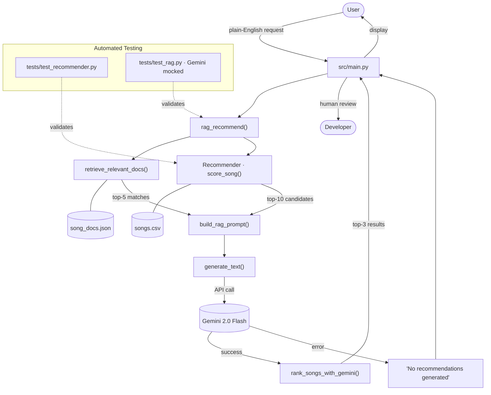

# 🎵 Music Recommender Simulation

## Project Title and Summary

This repository extends the original **Music Recommender Simulation** into a hybrid AI system.

Originally, the project explored how song recommendations can be generated by matching a user's profile to a song's attributes. It rewarded exact genre and mood matches while also using proximity scoring for energy and acousticness. The original goal was to expose how recommender systems work behind the scenes and to recommend songs based on the match between a user's vibe and each song.

The extended version keeps that core scoring model, adds natural-language input, and uses Retrieval-Augmented Generation (RAG) with Gemini to improve relevance and explanation. The system now accepts plain-English requests, retrieves song context from `data/song_docs.json`, and uses AI to rank and explain the best matches.

---

## Architecture Overview

The system is built from the following components:

- `src/main.py` — application entry point that accepts a user request and prints results
- `src/recommender.py` — core recommender that loads `data/songs.csv` and scores songs by profile match
- `data/song_docs.json` — retrieval corpus with song descriptions, mood summaries, and listening scenarios
- `src/rag.py` — retrieval pipeline that builds prompts and integrates Gemini ranking
- `src/gemini_client.py` — Gemini API wrapper for calling the model once per request
- `tests/test_recommender.py` — validates the base recommender logic
- `tests/test_rag.py` — validates the RAG path and prompt generation

The data flow is:
1. User request →
2. retrieve song context →
3. generate candidate songs →
4. send one prompt to Gemini →
5. return ranked recommendations + explanations.



---

## Setup Instructions

1. Create a virtual environment (optional but recommended):

   ```bash
   python -m venv .venv
   source .venv/bin/activate      # Mac or Linux
   .venv\Scripts\activate       # Windows
   ```

2. Install dependencies:

   ```bash
   pip install -r requirements.txt
   ```

3. Configure Gemini:
   - Copy `.env.example` to `.env`
   - Set `GEMINI_API_KEY=your_api_key_here`

4. Run the app:

   ```bash
   python -m src.main
   ```

5. Run automated tests:

   ```bash
   pytest
   ```

---

## Sample Interactions

These examples describe the plain-English request flow and the type of structured output the app returns. After you run the system with your own Gemini key, replace these example outputs with the actual recommendations and explanations from `src/main.py`.

### Example 1

**Input:** `Give me chill music for studying`

**Output:**
- `Chill Lofi Loop` — Artist: Test Artist, Genre: lofi, Mood: chill
- `Rooftop Lights` — Artist: Indigo Parade, Genre: indie pop, Mood: happy
- `Focus Flow` — Artist: LoRoom, Genre: lofi, Mood: focused

**AI Explanation:** "Chill Lofi Loop is selected because it matches a relaxed study vibe with low energy and high acousticness, and the retrieved document confirms it is ideal for focused work."

### Example 2

**Input:** `I want upbeat workout music`

**Output:**
- `Gym Hero` — Artist: Max Pulse, Genre: pop, Mood: intense
- `Pulse Protocol` — Artist: Phase Array, Genre: edm, Mood: euphoric
- `Sunrise City` — Artist: Neon Echo, Genre: pop, Mood: happy

**AI Explanation:** "Gym Hero is ranked highest because its energetic beat and strong motivation cues match an upbeat workout request, according to the retrieved song context."

### Example 3

**Input:** `Play something romantic for a cozy evening`

**Output:**
- `Velvet Hours` — Artist: Sable & Smoke, Genre: r&b, Mood: romantic
- `Golden Static` — Artist: Indigo Parade, Genre: pop, Mood: romantic
- `Sunday Soul` — Artist: Velvet Roots, Genre: soul, Mood: happy

**AI Explanation:** "Velvet Hours fits the romantic request with warm, smooth vocal styling and a cozy listening context."

---

## Design Decisions

I built this system to preserve the original recommendation model while adding AI where it adds the most value.

Key decisions:
- Use natural-language input so the recommender feels dynamic and accessible.
- Keep the existing score-based recommender for core matching logic.
- Add local retrieval from `data/song_docs.json` so the AI has concrete song context to reason on.
- Use Gemini to rank and explain candidate songs, creating a local retrieval + AI ranking workflow.

Trade-offs:
- I used simple keyword retrieval instead of embeddings to keep the implementation fast, transparent, and easy to explain.
- The candidate list is generated using a default profile, which is pragmatic and still supports AI ranking over the most relevant songs.
- This design emphasizes a hybrid system: local retrieval and deterministic scoring augmented by AI, rather than a fully end-to-end neural recommender.

---

## Testing Summary

The project includes both core recommender tests and RAG pipeline tests.

What worked:
- `tests/test_recommender.py` validates the original scoring and explanation logic.
- `tests/test_rag.py` validates retrieval, prompt building, Gemini response parsing, and the RAG recommendation flow.
- The system structure makes it easy to replace or improve the AI component later.

What remains limited:
- Live Gemini ranking depends on a valid API key and stable API output formatting.
- Prompt parsing assumes a consistent response format, so a more robust parser may be needed in future.
- The retrieval step is intentionally simple and may miss more nuanced semantic matches.

What I learned:
- AI should augment reliable code rather than replace it.
- Testing AI systems is best done by isolating prompt generation and response parsing.
- Clear documentation and human evaluation make the system stronger for a portfolio review.

---

## Reflection

This project taught me that hybrid AI systems are often the most practical: use deterministic logic for the parts you can control, and use AI for explanation and flexible ranking.

I also learned that building around a retrieval layer improves AI relevance, and that human review is essential when the model is making subjective decisions. Throughout this process, I found AI useful in helping plan out quickly an implementation; however, I would still need to verify as the human if the implementation being suggested is truly what needs to be done to achieve the goals of this project. This is where the human comes into the loop as well as verifying recommendation output and if RAG worked as intended for pulling certain keywords and using them to help recommend songs.
